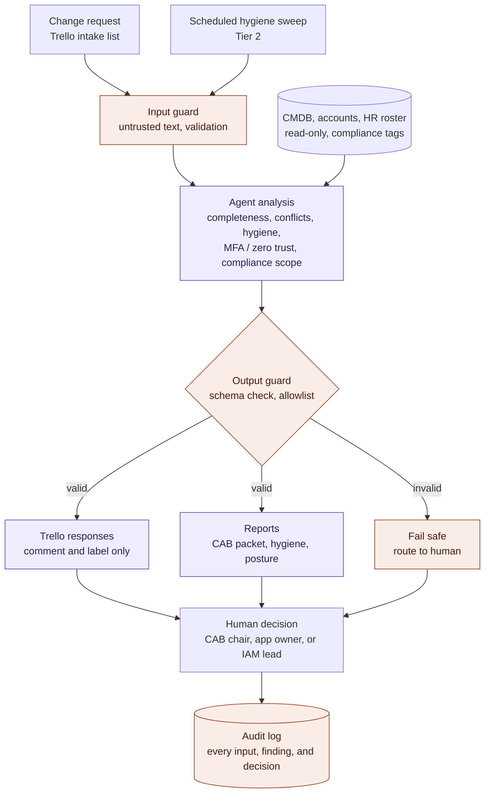

# Initial Project Draft: Change Review & CMDB Hygiene Assistant

## Section 1: Problem Statement

IT change control and configuration management data (CMDB) hygiene are two controls that auditors rely on and that operations teams struggle to keep up with. Change Advisory Boards (CABs) review requests that are often incomplete, missing rollback plans, understating risk, or colliding with other changes in the same window. Meanwhile, the CMDB those reviews depend on drifts out of date: owners leave the company, accounts go stale, applications claim controls they don't actually have, and security posture claims such as "MFA enforced" or "zero trust enabled" go unverified.

This project builds an AI assistant that does the analysis work before a human decides. Stated concretely, the full system will do the following (Section 3 splits these into core, planned, and stretch tiers):

1. Read change requests from a Trello intake board and check each one for completeness (justification, affected systems, risk, test plan, rollback plan, implementation window) and for conflicts with other scheduled changes.
2. Cross-check the affected application against the CMDB, flagging hygiene issues (orphaned or stale accounts, missing metadata, capability mismatches) and verifying MFA and zero trust claims against the CISA Zero Trust Maturity Model. Applications tagged as crown jewel, SOX, PCI DSS, or GxP in scope receive stricter checks and higher severity ratings.
3. Run a scheduled hygiene sweep across the full CMDB, including password hygiene checks based on account metadata (unvaulted privileged accounts, non-rotating service accounts, shared accounts, privileged access without MFA).
4. Post findings and clarifying questions to Trello and generate three reports: a CAB review packet, a CMDB hygiene report, and a security posture summary.

The assistant automates analysis and responses only. It never approves, rejects, or defers a change, and never edits the CMDB. Every decision is routed to a named human: the CAB chair for changes, and the application owner or IAM lead for hygiene findings.

Success is checkable: for a labeled set of change requests and CMDB records, did the system surface the planted issues, and did its findings hold up?

This is an AI engineering problem rather than a scripting problem because the hard cases require judgment over unstructured text and context. A script can find every account with no login in 90 days. It cannot decide whether that account belongs to an owner on leave, a service account another team legitimately uses, or a genuine orphan. A script cannot tell whether a free-text rollback plan is real or a placeholder, or whether "SSO + VPN with device certificate" justifies a "zero trust enabled" claim (it supports MFA, but not full zero trust). Applying NIST SP 800-63B correctly is similar: forced password rotation is not a finding for a standard MFA-protected user, but it is critical for a privileged service account. These are judgment calls an LLM can make with the right rubric and evidence.

## Section 2: Target Users

The primary users are IT operations and security staff in mid-to-large organizations who are being asked to do more with fewer people:

- **CAB chairs and change managers** preparing for weekly CAB meetings, who need to know which changes are ready, which are risky, and what's missing before the meeting rather than during it.
- **IAM and security analysts** responsible for account hygiene and audit readiness, who currently find orphaned accounts and posture gaps through manual spreadsheet reviews.
- **Application owners**, who receive specific, evidence-backed requests to confirm or correct their records instead of vague audit findings.

They would use it a second time if its findings are accurate, cite their evidence (the specific CMDB field or card text behind each finding), and save real preparation time. The CAB packet and hygiene report should be usable as-is in a meeting or audit.

They would abandon it if it produces false alarms they have to dismiss one by one, makes confident claims without evidence, or overstates its authority. A tool that appears to "approve" changes would be unacceptable in a regulated environment, which is why the human-in-the-loop boundary is a core design requirement rather than an add-on.

## Section 3: Candidate Approach

**Workflow:** Every path ends with a human decision. The agent's analysis is bracketed by security controls on both the input and output side, and every step is written to the audit log.

*Purple: agent steps. Orange: security controls. Uncolored: humans, data sources, and triggers.*

**Technique:** An agent using prompting with tool calling. The agent calls a small set of Python tools: Trello read/comment/label functions, CMDB and account lookups, and deterministic checks (stale accounts, missing fields, scheduling conflicts). Deterministic code finds candidate issues, and the LLM handles the judgment: clearing false positives, assigning severity, evaluating posture claims against a rubric, and writing findings and reports. Rubrics (CISA Zero Trust Maturity Model pillars, ITIL change criteria, NIST SP 800-63B password guidance) will be supplied in the prompt. Retrieval (RAG) will be added only if the policy material outgrows the context window. Finetuning is not planned; the labeled data set is for evaluation, not training.

**Models:** A hosted model with strong tool-calling support (Claude or GPT-class) as the primary model, because tool-use reliability matters more than cost at this data volume and all data is synthetic. If time allows, I will compare against a local open model via Ollama, since a real deployment handling sensitive CMDB data might require local hosting.

**Data:** All data is synthetic. A Python generator creates a CMDB of roughly 50 applications with compliance scope tags, an account inventory, and an HR roster, then deliberately plants defects and writes each one to an answer key. I will also write 60–80 change requests on a Trello board, including complete requests, incomplete ones, understated-risk ones, conflicting ones, and overstated security posture claims.

**Built-in security controls:** Card text is treated as untrusted input. The agent uses least-privilege API tokens (comment and label only on Trello; read-only on the CMDB), and secrets are stored in environment variables. Model output must validate against a JSON schema, and code (not the model) enforces an allowlist of permitted actions. Invalid or failed analysis is routed to a human rather than defaulted. Every input, finding, and human decision is written to an audit log. Risks will be mapped to the OWASP Top 10 for LLM Applications.

**Framework and compliance alignment:** The pipeline implements three ITIL 4 practices: change enablement (pre-review, conflict detection, and human authorization), service configuration management (the CMDB as the source of truth, kept accurate through hygiene checks), and information security management (posture verification and the agent's own controls). It also follows the ITIL 4 guiding principles. It starts where the organization is, using the existing Trello board and CMDB. It keeps things simple and practical by using deterministic checks first and AI only for judgment. It progresses iteratively with feedback through the tiered build, and it automates analysis while keeping decisions with people. Compliance scope drives stricter rules:

- **Crown jewel** applications are automatically elevated to higher risk and senior review, are expected to use phishing-resistant MFA, and have freeze-window conflicts flagged as critical.
- **SOX** in-scope changes require segregation of duties (requester, implementer, and approver must be different people) and documented test evidence and approval before implementation.
- **PCI DSS** in-scope changes are checked for MFA on all access into the cardholder data environment.
- **GxP** in-scope changes to validated systems require a documented impact assessment and validation evidence.

Hygiene findings on any in-scope application, such as an orphaned account on a SOX system, are rated critical.

**Hardest part:** Making the synthetic data realistic enough that the ambiguous cases are genuinely ambiguous. If planted defects are too obvious, a rules-only script catches everything and the AI adds nothing measurable. The second risk is prompt injection through change request text, which I will test directly.

**Changes since Week 1:** My Week 1 proposal had two separate candidates, a CMDB Data Quality Discovery Agent and a Privileged User Behavior Analytics system, with evaluation based on production ground truth. I have changed three things:

1. **Synthetic data replaces production data.** Production data is not available to me for this project. Synthetic data with planted defects provides an exact answer key, which makes evaluation cleaner.
2. **Log correlation is dropped to fit the term.** I replaced raw Windows Event Log and Secret Server correlation with summarized account fields (last login, vault checkout count).
3. **CMDB hygiene now feeds a change review workflow.** Hygiene problems surface where they cause real risk, and the human-in-the-loop decision model reflects how change control works in regulated environments.

**Scope tiers:** To keep the project feasible for one term, the work is split into three tiers. Each tier is built and evaluated before the next begins, so the project remains complete and demonstrable at whichever tier it reaches.

- **Tier 1, Core (must ship):** change request review on Trello (completeness and conflict checks); CMDB lookup for the affected application covering orphaned accounts, stale accounts, and metadata gaps; MFA and zero trust verdicts; compliance scope tags (crown jewel, SOX, PCI DSS, GxP) with risk and severity escalation; a single combined review report; essential security controls (least-privilege tokens, untrusted-input handling, schema validation with an action allowlist, fail-safe routing to a human, and an audit log); and evaluation against the answer key, the rules-only baseline, and prompt injection test cases.
- **Tier 2, Planned:** the scheduled hygiene sweep across the full CMDB, capability mismatch checks, the split into three separate reports (CAB packet, hygiene report, posture summary), Trello notice cards assigned to application owners, segregation-of-duties checks for SOX-scoped changes, detection of untagged compliance scope from change request text, and a tamper-evident (hash-chained) audit log.
- **Tier 3, Stretch:** password hygiene checks, a comparison against a local open model via Ollama, redaction of sensitive fields before data reaches a hosted model, and retrieval for policy material if needed.

Anything not completed in Tier 2 or Tier 3 will be documented as future work.

## Section 4: First-Draft Evaluation Plan

**What I'll measure, on what:** All metrics are computed against the answer key generated with the synthetic data set and my labels for the 60–80 change requests.

- **Issue detection:** precision and recall per issue type (missing change fields, conflicts, orphaned accounts, stale accounts, capability mismatches, metadata gaps, password hygiene issues).
- **Posture verdicts:** agreement between the agent's MFA and zero trust verdicts and my labels, with a specific count of overstated claims caught.
- **Compliance scope handling:** how often in-scope changes receive the required escalation and checks, including planted changes that touch a crown jewel, SOX, PCI DSS, or GxP system without being tagged.
- **Ambiguous-case handling:** on the planted tricky cases (owner on leave, legitimate shared service account, name variants), how often the agent correctly clears or confirms the issue.
- **Baseline comparison:** the same metrics for the deterministic checks alone, without the LLM. The difference is the measurable value of the AI layer.
- **Recommendation agreement:** how often the agent's advisory recommendation matches the decision I record as the human reviewer.
- **Grounding:** the share of findings that cite evidence that actually exists in the card or CMDB.
- **Prompt injection resistance:** the share of planted injection attempts that fail to change the agent's output or actions.

**What counts as success:** These targets apply to the Tier 1 core and extend to each later tier as it is built.

- Recall of at least 85% on critical issues, with precision of at least 80%.
- At least 90% of findings correctly grounded.
- Zero unauthorized actions, regardless of injection attempts.
- A clear improvement over the rules-only baseline on the ambiguous cases.

**What's hard to measure:** Report quality and real-world time savings. I can score reports with a rubric (accuracy, completeness, actionability), possibly assisted by an LLM judge, but without real CAB members I can't directly measure whether the tool saves preparation time. My own labels also carry my own judgment, so agreement metrics measure consistency with one experienced reviewer rather than an objective truth.
